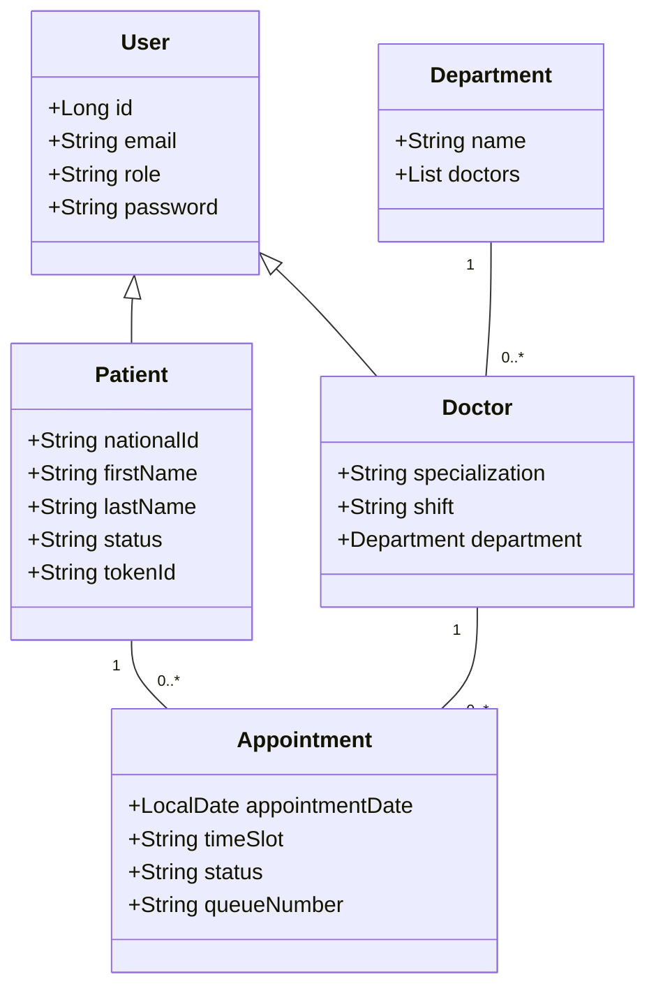
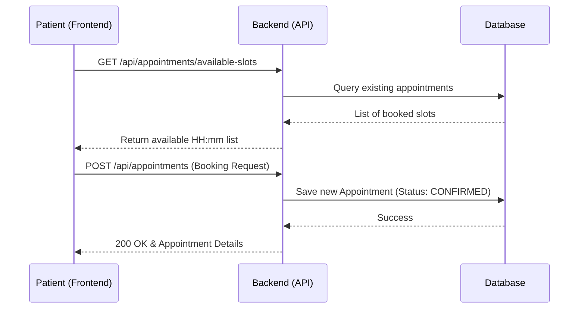
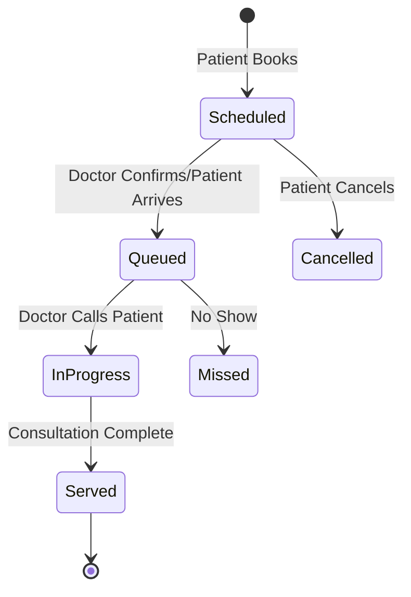

# AfyaFlow - UML Diagram Prompts & Architecture

Use these Mermaid.js prompts to generate system diagrams for your presentation or final report.

## 1. Class Diagram (Data Model)

## 2. Sequence Diagram (Booking Flow)

## 3. State Diagram (Queue Management)

## 4. Architecture Overview
- **Frontend**: React 19 + TypeScript + Vite
- **Backend**: Spring Boot 3.x + Spring Security (JWT)
- **Database**: MySQL (Persistence) / H2 (Development)
- **Styling**: Tailwind CSS 4.0
